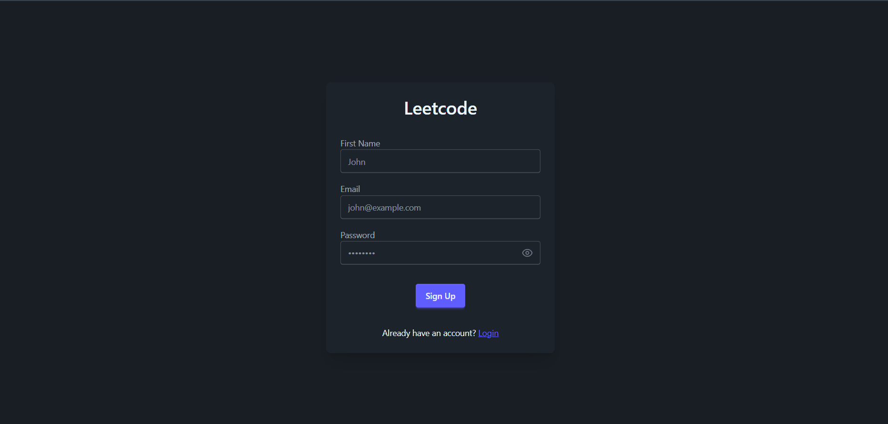
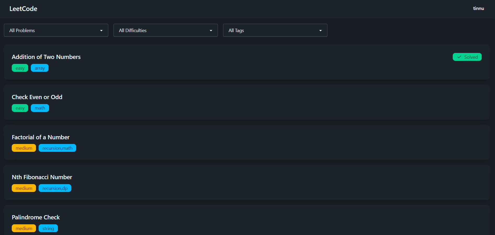
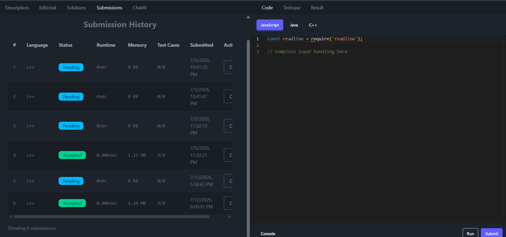
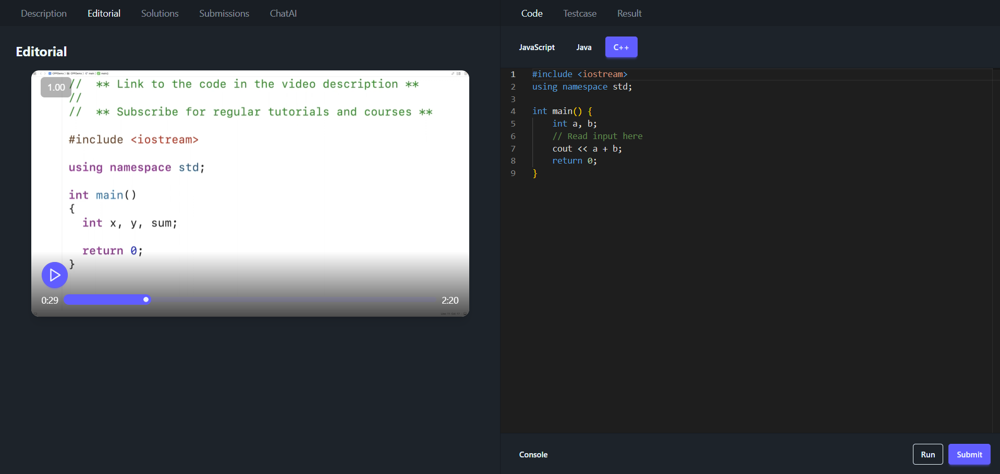
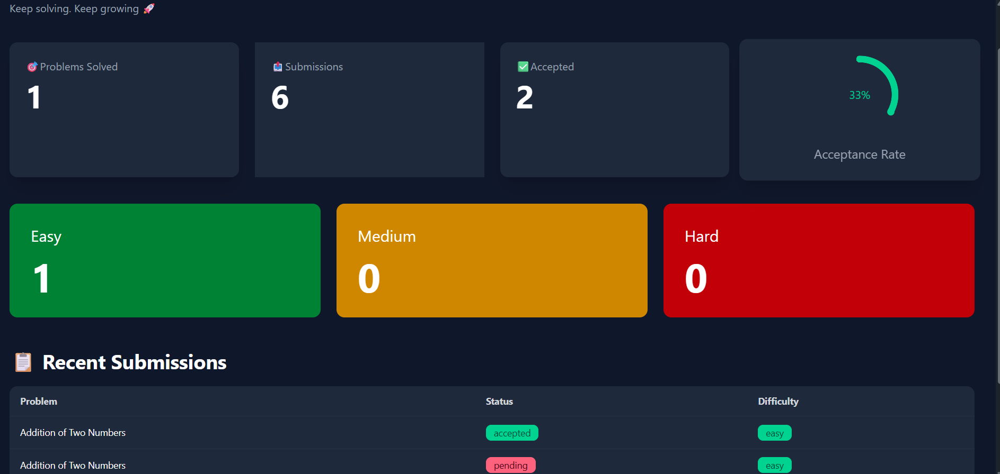

<div align="center">

# 🚀 AI-Powered LeetCode Style Coding Platform

A full-stack coding platform inspired by LeetCode where users can solve coding problems, execute code online, track submissions, and get AI-powered coding assistance.

[](https://react.dev/)
[](https://nodejs.org/)
[](https://expressjs.com/)
[](https://www.mongodb.com/)
[](https://redis.io/)
[](https://tailwindcss.com/)

[🌐 Live Demo](https://leetcode-style-platform.vercel.app) &nbsp;·&nbsp; [📂 GitHub Repository](https://github.com/Saurabh29044004/Leetcode-style-platform)

</div>

---

## 📖 Table of Contents

- [About the Project](#-about-the-project)
- [Features](#-features)
- [Tech Stack](#-tech-stack)
- [Screenshots](#-screenshots)
- [Folder Structure](#-folder-structure)
- [Installation](#️-installation)
- [Environment Variables](#-environment-variables)
- [Deployment](#-deployment)
- [Future Improvements](#-future-improvements)
- [Author](#-author)
- [Support](#-support)

---

## 📌 About the Project

This platform replicates the core experience of competitive coding websites like LeetCode — allowing users to browse problems, write and execute code in multiple languages, receive instant feedback through visible and hidden test cases, and track their progress over time. It also integrates an AI coding assistant to help users understand problems better and improve their solutions.

Built as a complete end-to-end system covering authentication, an online judge integration, an admin panel for content management, and a real-time code execution pipeline.

---

## ✨ Features

### 👤 User Authentication
- Secure Login & Signup
- JWT Authentication
- Protected Routes
- Cookie-based Authentication

### 💻 Online Code Execution
- Run code instantly
- Submit solutions
- Multiple programming language support
- Hidden & Visible Test Cases
- Judge0 API Integration

### 🤖 AI Coding Assistant
- Gemini AI Integration
- Ask coding doubts
- Get optimized solutions
- Code explanations

### 📊 User Dashboard
- Problems Solved
- Total Submissions
- Acceptance Rate
- Easy / Medium / Hard Statistics
- Recent Submissions

### 👨‍💼 Admin Panel
- Add Coding Problems
- Update Problems
- Delete Problems
- Manage Test Cases

---

## 🛠 Tech Stack

<table>
<tr>
<td valign="top" width="33%">

**Frontend**
- React.js
- React Router
- Redux Toolkit
- Tailwind CSS
- DaisyUI
- Axios

</td>
<td valign="top" width="33%">

**Backend**
- Node.js
- Express.js
- MongoDB
- Mongoose
- Redis
- JWT Authentication

</td>
<td valign="top" width="33%">

**APIs & Services**
- Judge0 API
- Google Gemini AI
- Cloudinary
- MongoDB Atlas

</td>
</tr>
</table>

---

## 📸 Screenshots







---

## 📂 Folder Structure

```
Leetcode-style-platform/
├── backend/          # Express server, APIs, DB models, Judge0 & Gemini integration
├── frontend/         # React app, components, pages, Redux store
└── README.md
```

---

## ⚙️ Installation

### 1. Clone the Repository
```bash
git clone https://github.com/Saurabh29044004/Leetcode-style-platform.git
cd Leetcode-style-platform
```

### 2. Backend Setup
```bash
cd backend
npm install
npm run dev
```

### 3. Frontend Setup
```bash
cd frontend
npm install
npm run dev
```

The frontend will run on `http://localhost:5173` (default Vite port) and the backend on the port defined in your `.env` file.

---

## 🔐 Environment Variables

Create a `.env` file in the `backend/` directory with the following variables:

```env
PORT=
DB_CONNECT_STRING=
JWT_KEY=
REDIS_PASS=
JUDGE0_KEY=
JUDGE0_URL=
GEMINI_KEY=
CLOUDINARY_CLOUD_NAME=
CLOUDINARY_API_KEY=
CLOUDINARY_API_SECRET=
```

Create a `.env` file in the `frontend/` directory:

```env
VITE_BACKEND_URL=
```

> ⚠️ Never commit your `.env` files. Make sure they are listed in `.gitignore`.

---

## 🚀 Deployment

| Layer | Platform |
|---|---|
| Frontend | Vercel |
| Backend | Render |
| Database | MongoDB Atlas |

---

## 📈 Future Improvements

- [ ] Coding Contests
- [ ] Leaderboard
- [ ] Discussion Forum
- [ ] Friend System
- [ ] Notifications
- [ ] Company-wise Questions
- [ ] Premium Problem Sets

---

## 👨‍💻 Author

**Saurabh Gupta**
B.Tech Computer Science
IIIT Bhagalpur

[](https://github.com/Saurabh29044004)
[](www.linkedin.com/in/saurabhgupta523)

---

## ⭐ Support

If you like this project, consider giving it a ⭐ on GitHub.
It really helps and motivates me to build more projects.
